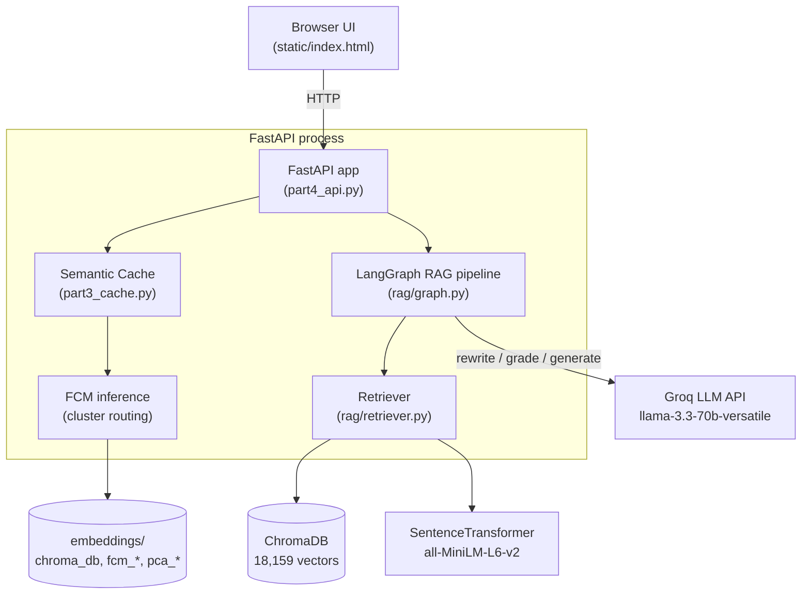
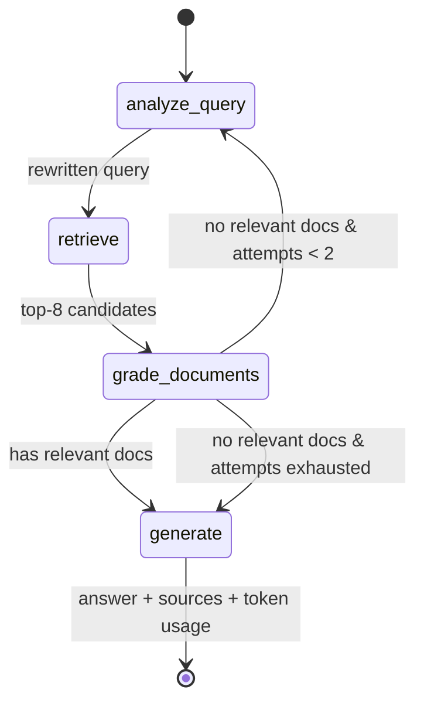

# Architecture

A deep dive into how **Semantic RAG Search** is put together — the components, the
data flow, and the design decisions (with their tradeoffs) that shaped it.

This document complements the higher-level [`README.md`](../README.md), the
[Software Requirements Specification](Software_Requirements_Specification.md),
and the [Software Design Document](Software_Design_Document.md).

---

## 1. System overview

The system answers natural-language questions over the **20 Newsgroups** corpus
(~18,000 Usenet posts from 1993) using a Retrieval-Augmented Generation (RAG)
pipeline. A single FastAPI process hosts everything: the web UI, the semantic
search endpoint, the semantic cache, and the LangGraph RAG pipeline.



Everything below `embeddings/` is a **build artifact** produced by the offline
data-prep scripts. It is not committed to the repo — you generate it once
locally (see [Build pipeline](#5-offline-build-pipeline)).

---

## 2. Request flow

There are two entry points that matter, and they behave very differently.

### 2.1 `/query` — pure semantic search (with cache)

```
POST /query
   │
   ├─ embed query  ── SentenceTransformer (all-MiniLM-L6-v2, normalised)
   │
   ├─ cache.lookup(query, embedding)
   │     ├─ FCM assigns soft cluster memberships
   │     ├─ search top-2 cluster buckets for nearest neighbour
   │     └─ similarity ≥ θ (0.85)?  ── HIT → return cached result
   │
   ├─ (miss) search_corpus() ── ChromaDB top-5 vectors
   │
   └─ cache.store(...) → return result + dominant_cluster
```

No LLM is involved here — it is a fast vector lookup with a semantic cache in
front. This is the cheapest path and demonstrates the clustering work on its own.

### 2.2 `/rag/query` — the full RAG pipeline

This is the interesting path. It runs as a **LangGraph state machine**
(`rag/graph.py`), where each stage is a node that reads and writes a shared
`RAGState` (`rag/state.py`).



| Node | File / fn | Responsibility |
|---|---|---|
| `analyze_query` | `graph.analyze_query` | Pass the query through on attempt 1; on retry, ask the LLM to **rewrite** it for better recall. |
| `retrieve` | `graph.retrieve` → `retriever.retrieve_with_scores` | Embed the (rewritten) query and pull the **top 8** vectors from ChromaDB, attaching a normalised `retrieval_score`. |
| `grade_documents` | `graph.grade_documents` | Drop anything below `RELEVANCE_THRESHOLD` (0.3), then ask the LLM per-doc "is this relevant? YES/NO" until **5** pass. |
| `route_after_grading` | `graph.route_after_grading` | If relevant docs exist → `generate`. Else, if `rewrite_attempts < 2` → loop back to `analyze_query`. Else → `generate` (fallback answer). |
| `generate` | `graph.generate` | Build a numbered context block from the graded docs and ask the LLM for a **grounded, cited** answer; return `sources` + token usage. |

The key control-flow idea is the **self-correcting retry loop**: bad retrieval
doesn't immediately produce a bad answer — the graph rewrites the query and tries
again (bounded to `MAX_REWRITE_ATTEMPTS = 2` so it can never spin forever).

---

## 3. Component responsibilities

| Component | Location | One-line responsibility |
|---|---|---|
| **API layer** | `part4_api.py` | HTTP surface, request validation, app lifespan/startup, component wiring. |
| **RAG pipeline** | `rag/graph.py` | The LangGraph state machine: rewrite → retrieve → grade → generate. |
| **State schema** | `rag/state.py` | `TypedDict` describing everything that flows between graph nodes. |
| **Retriever** | `rag/retriever.py` | ChromaDB vector search + query embedding, with `lru_cache`'d model/collection. |
| **Prompts** | `rag/prompts.py` | All LLM prompt templates, kept out of the logic. |
| **Config** | `rag/config.py` | Paths, model names, thresholds, env-var reads — the single source of tunables. |
| **Semantic cache** | `part3_cache.py` | Cluster-accelerated nearest-neighbour cache over past queries. |
| **Web UI** | `static/index.html` | Single-page frontend for querying and running live evaluation. |
| **Data prep** | `scripts/part1_prepare.py` | Download corpus, embed it, write vectors into ChromaDB. |
| **Clustering** | `scripts/part2_clustering.py` | Train the Fuzzy C-Means model + PCA used by the cache. |
| **Evaluation** | `scripts/part5_evaluate.py` | Run RAGAS metrics from the command line. |

---

## 4. Data & storage model

Everything the running app needs at query time lives under `embeddings/`:

| Artifact | Produced by | Used by | Purpose |
|---|---|---|---|
| `chroma_db/` | `part1_prepare.py` | retriever, `/query` | Persistent vector store (18,159 docs, cosine space). |
| `embeddings.npy` | `part1_prepare.py` | `part2_clustering.py`, cache | Raw corpus embeddings (used to derive the PCA mean). |
| `embeddings_pca.npy` | `part2_clustering.py` | cache | PCA-reduced embeddings for clustering. |
| `pca_components.npy` | `part2_clustering.py` | cache (`FCMInference`) | PCA projection matrix for new queries. |
| `fcm_centers.npy` | `part2_clustering.py` | cache | Fuzzy C-Means cluster centroids. |
| `fcm_config.json` | `part2_clustering.py` | cache | `n_clusters`, fuzziness `m`, `pca_dim`. |

### Read-only filesystem workaround

Hugging Face Spaces mounts the app filesystem read-only, but ChromaDB wants to
open its store read-write. Both `rag/config.py` and `part4_api.py` copy
`embeddings/chroma_db` to `/tmp/chroma_db` at startup and point the client there.
It's a small but load-bearing detail — without it the Space fails to boot.

---

## 5. Offline build pipeline

The corpus and models are built **once**, offline, and are intentionally *not*
committed (they're large and regenerable):

```
setup.py
   ├─ scripts/part1_prepare.py    # fetch 20 Newsgroups → embed → ChromaDB
   └─ scripts/part2_clustering.py # PCA + Fuzzy C-Means → fcm_*, pca_* artifacts
```

Run `python scripts/part1_prepare.py && python scripts/part2_clustering.py`
(≈10 min, one time) before starting the server. The runtime process only ever
*reads* these artifacts.

---

## 6. Design decisions & tradeoffs

The parts worth explaining are the non-obvious ones.

### 6.1 Cluster-accelerated semantic cache (the most interesting decision)

The cache's job is to answer *"have I seen a semantically equivalent query
before?"* A naive cache scans every stored query embedding — **O(N·D)** dot
products per lookup. Instead, we route through the **Fuzzy C-Means** clusters
built in `part2_clustering.py`:

1. Assign the incoming query soft memberships across `K` clusters (O(K·D)).
2. Search only the **top-2** cluster buckets by membership.
3. Fall back to a global scan only if those buckets are empty.

For `N` entries and `K` clusters this drops the average lookup toward
**O(N/K · D)** — roughly a `K`-fold speedup once the cache holds thousands of
entries.

**The tradeoff:** a query sitting on a cluster boundary may have its true nearest
neighbour in an *adjacent* bucket, causing a false miss. Searching the top-2
clusters (rather than only the dominant one) recovers the large majority of those
neighbours at ~2× cost; top-3 adds <1% recall for 3× cost, so we stop at 2. The
flat entry list is still kept for correctness and as a fallback.

### 6.2 The similarity threshold θ = 0.85

θ decides when a cached answer is reused versus recomputed. It is the single most
consequential tunable in the cache:

- **θ too low (~0.70):** almost everything "hits" — the cache degrades into a
  coarse, often-wrong lookup table.
- **θ too high (~0.95):** effectively an exact-match cache; it almost never helps.
- **θ = 0.85:** captures genuine paraphrase equivalence
  (`"guns in america"` ≈ `"gun ownership statistics US"`) without collapsing
  distinct questions. Empirically the precision/recall inflection sits around
  0.82–0.88, and 0.85 lands in the middle of it.

The long-form reasoning lives in the `SemanticCache` docstring in
`part3_cache.py`.

### 6.3 LangGraph over a hand-rolled pipeline

Modelling rewrite → retrieve → grade → generate as an explicit **state machine**
makes the self-correcting retry loop a first-class, inspectable edge rather than
tangled control flow. Each node is independently testable, and adding a stage
(e.g. re-ranking) is a node insertion, not a rewrite.

### 6.4 Direct ChromaDB + SentenceTransformers (not `langchain-chroma`)

`rag/retriever.py` talks to ChromaDB and the embedding model directly and caches
both with `lru_cache(maxsize=1)`. This avoids an extra abstraction layer, keeps
the scoring math explicit (`score = 1 - distance/2`), and makes cold-start
behaviour predictable — the model and collection load exactly once per process.

### 6.5 Groq free-tier LLM

`llama-3.3-70b-versatile` on Groq is fast and free, which matters because the
pipeline can call the LLM several times per request (rewrite + per-doc grading +
generation). Every LLM interaction is funnelled through `rag/prompts.py` and
`rag/config.py`, so switching providers/models is a config change
(`RAG_LLM_MODEL`), not a code change.

### 6.6 Reference-free evaluation (RAGAS)

The 20 Newsgroups dataset has no question/answer ground truth, so evaluation uses
RAGAS metrics that need none: **faithfulness**, **answer relevancy**, and
**context precision**. This lets quality be measured on-demand — from the CLI
(`scripts/part5_evaluate.py`) or live in the UI via `/rag/evaluate`.

---

## 7. Failure modes & resilience

| Scenario | Behaviour |
|---|---|
| `GROQ_API_KEY` missing | `/rag/*` returns **503**; `/query` (search-only) still works. |
| Embedding model fails to load | `/query` returns **503**; `/health` reports `corpus_loaded=false`. |
| FCM artifacts absent | Cache falls back to a **flat cosine search** (single bucket) — correct, just slower. |
| Per-doc grader LLM error | That document is optimistically **kept** rather than dropped, so a transient LLM error can't silently empty the context. |
| No relevant docs after retries | `generate` returns a graceful **fallback answer** instead of hallucinating. |
| Startup component error | Caught and logged in the lifespan handler; `/health` surfaces exactly which components loaded. |

`/health` is the ground truth for what actually came up:
`corpus_loaded`, `fcm_loaded`, `cache_entries`, and `rag_ready`.

---

## 8. Deployment

- **Container:** `Dockerfile` builds a slim Python 3.12 image, runs as a
  non-root `appuser`, exposes port **7860**, and defines a `/health`
  `HEALTHCHECK`.
- **Local orchestration:** `docker-compose.yml` mounts `embeddings/` read-only so
  artifacts can be swapped without rebuilding the image.
- **Hosting:** Hugging Face Spaces (Docker runtime) on port 7860.
- **Keep-alive:** `.github/workflows/keep-alive.yml` pings `/health` on a schedule
  so the free-tier Space doesn't cold-start for visitors.
- **CI:** `.github/workflows/ci.yml` byte-compiles the sources and runs Ruff
  (error rules only) on every push and PR.
